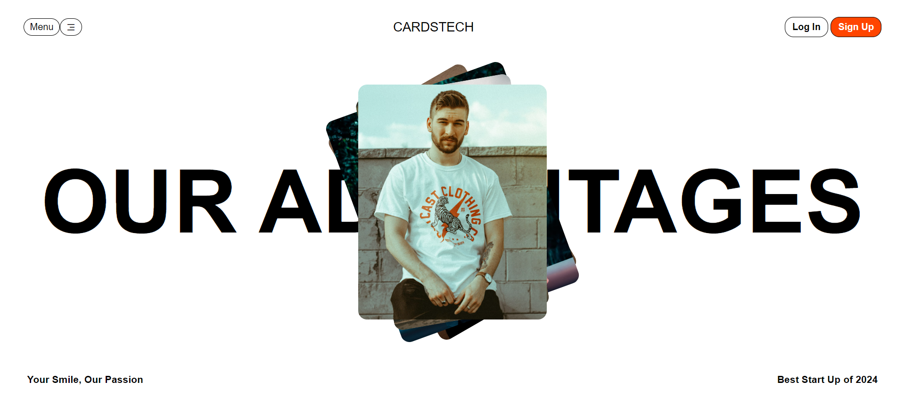

# Static Website Tutorial Project - Card Website

## Description
This project is a basic static website created by following a tutorial from Sheryians Coaching School YouTube channel. The website was built using only HTML and CSS, making it an excellent starting point for beginners to learn web development.

## Technologies Used
- HTML
- CSS

## Features
- Simple and clean user interface.
- Static content layout.
- CSS styling for visual appeal.

## Screenshot

## Acknowledgements
Special thanks to [Sheryians Coaching School](https://www.youtube.com/@thesheryianscodingschool) for providing the tutorial and guidance to create this static website.

## Author
This project is created by [Vishal Pandey].
